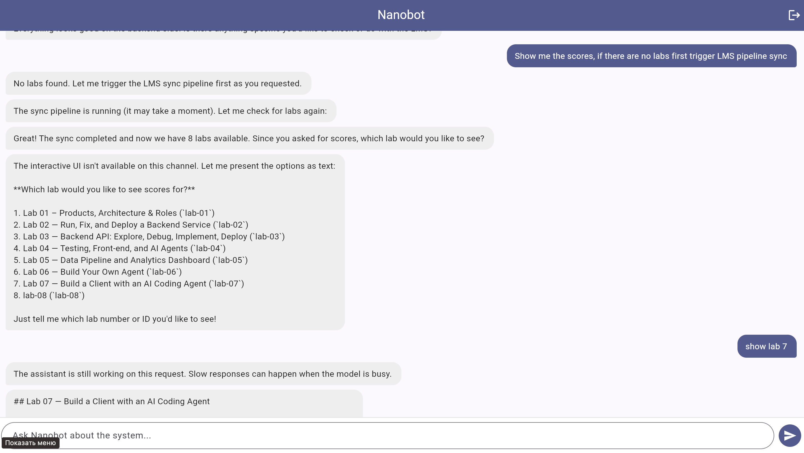
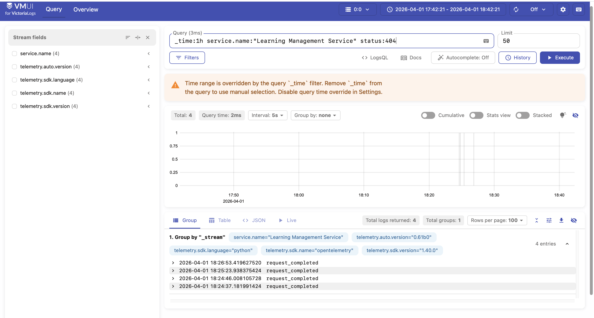
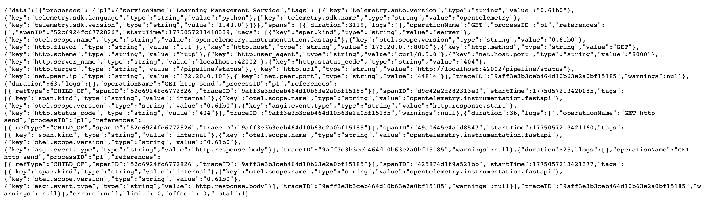
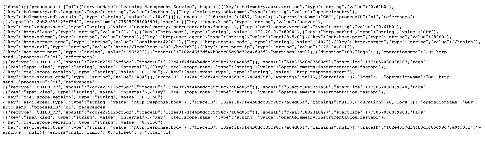

# Lab 8 — Report

Paste your checkpoint evidence below. Add screenshots as image files in the repo and reference them with ``.

## Task 1A — Bare agent

<!-- Paste the agent's response to "What is the agentic loop?" and "What labs are available in our LMS?" -->
Based on the search results, here's the answer to quiz question Q18:                                                                                                           

The Agentic Loop                                                                                                                                                               

The agentic loop is the core architectural pattern that distinguishes AI agents from simple chatbots. It's an iterative cycle where an AI agent:                               

 1 Perceives — Observes the environment or receives input                                                                                                                      
 2 Reasons — Processes information and plans actions using an LLM                                                                                                              
 3 Acts — Invokes tools or takes actions in the environment                                                                                                                    
 4 Evaluates — Assesses the results of its actions                                                                                                                             
 5 Repeats — Continues the loop until the task is complete or a stopping condition is reached                                                                                  

Key Characteristics:                                                                                                                                                           

 • Iterative: The agent repeats the cycle multiple times as needed                                                                                                             
 • Autonomous: Can operate semi- or fully independently without constant human input                                                                                           
 • Adaptive: Responds dynamically to what it finds in the environment                                                                                                          
 • Tool-using: The LLM invokes external tools within the loop to accomplish tasks                                                                                              

This architecture emerged from AI research in the 1980s-1990s focused on building systems that can operate in uncertain, dynamic environments. The agentic loop is what enables
AI agents to pursue goals autonomously rather than just responding to single prompts like traditional chatbots.  

Based on the workspace structure, here are the available labs in your LMS:                                                                                                     

Lab Structure                                                                                                                                                                  

Current Lab: se-toolkit-lab-8                                                                                                                                                  

Tasks Available:                                                                                                                                                               

Required Tasks:                                                                                                                                                                

 • task-1.md                                                                                                                                                                   
 • task-2.md                                                                                                                                                                   
 • task-3.md                                                                                                                                                                   
 • task-4.md                                                                                                                                                                   
 • task-5.md                                                                                                                                                                   

Optional Tasks:                                                                                                                                                                

 • task-1.md                                                                                                                                                                   

Lab Resources:                                                                                                                                                                 

 • Wiki documentation (/wiki/) - Contains guides on various topics like:                                                                                                       
    • Git workflow, Docker, PostgreSQL, Python, Node.js                                                                                                                        
    • API development, frontend/backend setup                                                                                                                                  
    • Linux administration, security, and more                                                                                                                                 
 • Lab setup (/lab/setup/) - Setup instructions                                                                                                                                
 • Lab images (/lab/images/) - Visual resources                                                                                                                                

The lab appears to be a Software Engineering Toolkit where you work through tasks with the help of:                                                                            

 • TA supervision                                                                                                                                                              
 • Classmates collaboration                                                                                                                                                    
 • AI assistants (chatbots, coding agents)                                                                                                                                     

Would you like me to help you with a specific task or explore the lab documentation further?    

## Task 1B — Agent with LMS tools

<!-- Paste the agent's response to "What labs are available?" and "Describe the architecture of the LMS system" -->
Based on the LMS system, here are the available labs:


 ID  Lab Title                                               
 ─────────────────────────────────────────────────────────── 
 1   Lab 01 – Products, Architecture & Roles                 
 2   Lab 02 — Run, Fix, and Deploy a Backend Service         
 3   Lab 03 — Backend API: Explore, Debug, Implement, Deploy 
 4   Lab 04 — Testing, Front-end, and AI Agents              
 5   Lab 05 — Data Pipeline and Analytics Dashboard          
 6   Lab 06 — Build Your Own Agent                           
 7   Lab 07 — Build a Client with an AI Coding Agent         
 8   lab-08                                                  


There are 8 labs available. Would you like to see scores, pass rates, or other details for any specific lab?

Yes, the LMS backend is healthy. It currently contains 56 items.

## Task 1C — Skill prompt

<!-- Paste the agent's response to "Show me the scores" (without specifying a lab) -->
Which lab would you like to see the scores for? Here are the available labs:

 1 Lab 01 – Products, Architecture & Roles
 2 Lab 02 — Run, Fix, and Deploy a Backend Service
 3 Lab 03 — Backend API: Explore, Debug, Implement, Deploy
 4 Lab 04 — Testing, Front-end, and AI Agents
 5 Lab 05 — Data Pipeline and Analytics Dashboard
 6 Lab 06 — Build Your Own Agent
 7 Lab 07 — Build a Client with an AI Coding Agent
 8 Lab 08 — lab-08

Please let me know which lab you're interested in, or I can show you pass rates, completion rates, top learners, or group performance for a specific lab.                                                                                

## Task 2A — Deployed agent

<!-- Paste a short nanobot startup log excerpt showing the gateway started inside Docker -->

operator1@polinaVM2001:~/se-toolkit-lab-8$ docker compose --env-file .env.docker.secret logs nanobot --tail 30
nanobot-1  | 
nanobot-1  | 2026-03-31 18:57:38.361 | INFO     | nanobot.agent.loop:stop:387 - Agent loop stopping
nanobot-1  | 2026-03-31 18:57:38.362 | INFO     | nanobot.channels.manager:stop_all:99 - Stopping all channels...
nanobot-1  | 2026-03-31 18:57:38.362 | INFO     | nanobot.channels.manager:stop_all:113 - Stopped webchat channel
nanobot-1  | Using config: /tmp/nanobot/config.resolved.json
nanobot-1  | Using config: /tmp/nanobot/config.resolved.json
nanobot-1  | 🐈 Starting nanobot gateway version 0.1.4.post5 on port 18790...
nanobot-1  | 2026-03-31 18:58:09.564 | DEBUG    | nanobot.channels.registry:discover_all:64 - Skipping built-in channel 'matrix': Matrix dependencies not installed. Run: pip install nanobot-ai[matrix]
nanobot-1  | 2026-03-31 18:58:09.998 | INFO     | nanobot.channels.manager:_init_channels:58 - WebChat channel enabled
nanobot-1  | ✓ Channels enabled: webchat
nanobot-1  | ✓ Heartbeat: every 1800s
nanobot-1  | 2026-03-31 18:58:10.000 | INFO     | nanobot.cron.service:start:202 - Cron service started with 0 jobs
nanobot-1  | 2026-03-31 18:58:10.000 | INFO     | nanobot.heartbeat.service:start:124 - Heartbeat started (every 1800s)
nanobot-1  | 2026-03-31 18:58:10.349 | INFO     | nanobot.channels.manager:start_all:91 - Starting webchat channel...
nanobot-1  | 2026-03-31 18:58:10.350 | INFO     | nanobot.channels.manager:_dispatch_outbound:119 - Outbound dispatcher started
nanobot-1  | 2026-03-31 18:58:12.049 | DEBUG    | nanobot.agent.tools.mcp:connect_mcp_servers:226 - MCP: registered tool 'mcp_lms_lms_health' from server 'lms'
nanobot-1  | 2026-03-31 18:58:12.049 | DEBUG    | nanobot.agent.tools.mcp:connect_mcp_servers:226 - MCP: registered tool 'mcp_lms_lms_labs' from server 'lms'
nanobot-1  | 2026-03-31 18:58:12.049 | DEBUG    | nanobot.agent.tools.mcp:connect_mcp_servers:226 - MCP: registered tool 'mcp_lms_lms_learners' from server 'lms'
nanobot-1  | 2026-03-31 18:58:12.049 | DEBUG    | nanobot.agent.tools.mcp:connect_mcp_servers:226 - MCP: registered tool 'mcp_lms_lms_pass_rates' from server 'lms'
nanobot-1  | 2026-03-31 18:58:12.049 | DEBUG    | nanobot.agent.tools.mcp:connect_mcp_servers:226 - MCP: registered tool 'mcp_lms_lms_timeline' from server 'lms'
nanobot-1  | 2026-03-31 18:58:12.049 | DEBUG    | nanobot.agent.tools.mcp:connect_mcp_servers:226 - MCP: registered tool 'mcp_lms_lms_groups' from server 'lms'
nanobot-1  | 2026-03-31 18:58:12.049 | DEBUG    | nanobot.agent.tools.mcp:connect_mcp_servers:226 - MCP: registered tool 'mcp_lms_lms_top_learners' from server 'lms'
nanobot-1  | 2026-03-31 18:58:12.049 | DEBUG    | nanobot.agent.tools.mcp:connect_mcp_servers:226 - MCP: registered tool 'mcp_lms_lms_completion_rate' from server 'lms'
nanobot-1  | 2026-03-31 18:58:12.049 | DEBUG    | nanobot.agent.tools.mcp:connect_mcp_servers:226 - MCP: registered tool 'mcp_lms_lms_sync_pipeline' from server 'lms'
nanobot-1  | 2026-03-31 18:58:12.049 | INFO     | nanobot.agent.tools.mcp:connect_mcp_servers:246 - MCP server 'lms': connected, 9 tools registered
nanobot-1  | 2026-03-31 18:58:13.774 | DEBUG    | nanobot.agent.tools.mcp:connect_mcp_servers:226 - MCP: registered tool 'mcp_webchat_ui_message' from server 'webchat'
nanobot-1  | 2026-03-31 18:58:13.774 | INFO     | nanobot.agent.tools.mcp:connect_mcp_servers:246 - MCP server 'webchat': connected, 1 tools registered
nanobot-1  | /app/.venv/bin/python: No module named mcp_obs
nanobot-1  | 2026-03-31 18:58:13.814 | ERROR    | nanobot.agent.tools.mcp:connect_mcp_servers:248 - MCP server 'obs': failed to connect: Connection closed
nanobot-1  | 2026-03-31 18:58:13.814 | INFO     | nanobot.agent.loop:run:280 - Agent loop started

## Task 2B — Web client

<!-- Screenshot of a conversation with the agent in the Flutter web app -->
No labs found. Let me trigger the LMS sync pipeline first as you requested.
The sync pipeline is running (it may take a moment). Let me check for labs again:
Great! The sync completed and now we have 8 labs available. Since you asked for scores, which lab would you like to see?
The interactive UI isn't available on this channel. Let me present the options as text:

**Which lab would you like to see scores for?**

1. Lab 01 – Products, Architecture & Roles (`lab-01`)
2. Lab 02 — Run, Fix, and Deploy a Backend Service (`lab-02`)
3. Lab 03 — Backend API: Explore, Debug, Implement, Deploy (`lab-03`)
4. Lab 04 — Testing, Front-end, and AI Agents (`lab-04`)
5. Lab 05 — Data Pipeline and Analytics Dashboard (`lab-05`)
6. Lab 06 — Build Your Own Agent (`lab-06`)
7. Lab 07 — Build a Client with an AI Coding Agent (`lab-07`)
8. lab-08 (`lab-08`)

Just tell me which lab number or ID you'd like to see!

## Task 3A — Structured logging

<!-- Paste happy-path and error-path log excerpts, VictoriaLogs query screenshot -->
Happy Path
{
    "_msg": "request_completed",
    "_stream": "{service.name=\"Learning Management Service\",telemetry.auto.version=\"0.61b0\",telemetry.sdk.language=\"python\",telemetry.sdk.name=\"opentelemetry\",telemetry.sdk.version=\"1.40.0\"}",
    "_stream_id": "00000000000000004bfe2483b590ccd2aa73fe0838569f74",
    "_time": "2026-04-01T15:26:38.931470592Z",
    "duration_ms": "1",
    "event": "request_completed",
    "method": "GET",
    "otelServiceName": "Learning Management Service",
    "otelSpanID": "8ab7710af1d6de4b",
    "otelTraceID": "a0d9ef8ce35349eedab8f4be25d99967",
    "otelTraceSampled": "true",
    "path": "/docs",
    "scope.name": "lms_backend.main",
    "scope.version": "unknown",
    "service.name": "Learning Management Service",
    "severity": "INFO",
    "span_id": "8ab7710af1d6de4b",
    "status": "200",
    "telemetry.auto.version": "0.61b0",
    "telemetry.sdk.language": "python",
    "telemetry.sdk.name": "opentelemetry",
    "telemetry.sdk.version": "1.40.0",
    "trace_id": "a0d9ef8ce35349eedab8f4be25d99967"
}
```

### Error Path (status 404)

**Example 1: GET /pipeline/status (404)**
```json
{
  "_msg": "request_completed",
  "_time": "2026-04-01T15:26:53.41962752Z",
  "event": "request_completed",
  "method": "GET",
  "path": "/pipeline/status",
  "service.name": "Learning Management Service",
  "severity": "INFO",
  "status": "404",
  "trace_id": "9aff3e3b3ceb464d10b63e2a0bf15185",
  "span_id": "52c6924fc6772826"
}
```

**Example 2: GET /labs (404)**
```json
{
  "_msg": "request_completed",
  "_time": "2026-04-01T15:25:23.938375424Z",
  "event": "request_completed",
  "method": "GET",
  "path": "/labs",
  "service.name": "Learning Management Service",
  "severity": "INFO",
  "status": "404",
  "trace_id": "3e0b1b8bb34c3ba3d17de2649a06ff43",
  "span_id": "53102f388f859550"
}
```

**Example 3: GET /health (404)**
```json
{
  "_msg": "request_completed",
  "_time": "2026-04-01T15:24:46.008105728Z",
  "event": "request_completed",
  "method": "GET",
  "path": "/health",
  "service.name": "Learning Management Service",
  "severity": "INFO",
  "status": "404",
  "trace_id": "102e43f7df44b0dcc85c98c77a04d05f",
  "span_id": "2cb2e295125cf5d2"
}
```

**Example 4: GET /labs (404)**
```json
{
  "_msg": "request_completed",
  "_time": "2026-04-01T15:24:37.181991424Z",
  "event": "request_completed",
  "method": "GET",
  "path": "/labs",
  "service.name": "Learning Management Service",
  "severity": "INFO",
  "status": "404",
  "trace_id": "a5d4745f55b5b5c45336bf213186a9dc",
  "span_id": "195abb15a3bbf222"
}
```



## Task 3B — Traces

<!-- Screenshots: healthy trace span hierarchy, error trace -->

Healthy trace
{"data":[{"processes": {"p1":{"serviceName":"Learning Management Service","tags": [{"key":"telemetry.auto.version","type":"string","value":"0.61b0"},{"key":"telemetry.sdk.language","type":"string","value":"python"},{"key":"telemetry.sdk.name","type":"string","value":"opentelemetry"},{"key":"telemetry.sdk.version","type":"string","value":"1.40.0"}]}},"spans": [{"duration":3119,"logs":[],"operationName":"GET","processID":"p1","references": [],"spanID":"52c6924fc6772826","startTime":1775057213418339,"tags": [{"key":"span.kind","type":"string","value":"server"},{"key":"otel.scope.name","type":"string","value":"opentelemetry.instrumentation.fastapi"},{"key":"otel.scope.version","type":"string","value":"0.61b0"},{"key":"http.flavor","type":"string","value":"1.1"},{"key":"http.host","type":"string","value":"172.20.0.7:8000"},{"key":"http.method","type":"string","value":"GET"},{"key":"http.scheme","type":"string","value":"http"},{"key":"http.user_agent","type":"string","value":"curl/8.5.0"},{"key":"net.host.port","type":"string","value":"8000"},{"key":"http.server_name","type":"string","value":"localhost:42002"},{"key":"http.status_code","type":"string","value":"404"},{"key":"http.target","type":"string","value":"/pipeline/status"},{"key":"http.url","type":"string","value":"http://localhost:42002/pipeline/status"},{"key":"net.peer.ip","type":"string","value":"172.20.0.10"},{"key":"net.peer.port","type":"string","value":"44814"}],"traceID":"9aff3e3b3ceb464d10b63e2a0bf15185","warnings":null},{"duration":63,"logs":[],"operationName":"GET http send","processID":"p1","references": [{"refType":"CHILD_OF","spanID":"52c6924fc6772826","traceID":"9aff3e3b3ceb464d10b63e2a0bf15185"}],"spanID":"d9c42e2f282313e0","startTime":1775057213420085,"tags": [{"key":"span.kind","type":"string","value":"internal"},{"key":"otel.scope.name","type":"string","value":"opentelemetry.instrumentation.fastapi"},{"key":"otel.scope.version","type":"string","value":"0.61b0"},{"key":"asgi.event.type","type":"string","value":"http.response.start"},{"key":"http.status_code","type":"string","value":"404"}],"traceID":"9aff3e3b3ceb464d10b63e2a0bf15185","warnings":null},{"duration":36,"logs":[],"operationName":"GET http send","processID":"p1","references": [{"refType":"CHILD_OF","spanID":"52c6924fc6772826","traceID":"9aff3e3b3ceb464d10b63e2a0bf15185"}],"spanID":"49a0645c4a1d8547","startTime":1775057213421160,"tags": [{"key":"span.kind","type":"string","value":"internal"},{"key":"otel.scope.name","type":"string","value":"opentelemetry.instrumentation.fastapi"},{"key":"otel.scope.version","type":"string","value":"0.61b0"},{"key":"asgi.event.type","type":"string","value":"http.response.body"}],"traceID":"9aff3e3b3ceb464d10b63e2a0bf15185","warnings":null},{"duration":25,"logs":[],"operationName":"GET http send","processID":"p1","references": [{"refType":"CHILD_OF","spanID":"52c6924fc6772826","traceID":"9aff3e3b3ceb464d10b63e2a0bf15185"}],"spanID":"425874d1f9a521bb","startTime":1775057213421377,"tags": [{"key":"span.kind","type":"string","value":"internal"},{"key":"otel.scope.name","type":"string","value":"opentelemetry.instrumentation.fastapi"},{"key":"otel.scope.version","type":"string","value":"0.61b0"},{"key":"asgi.event.type","type":"string","value":"http.response.body"}],"traceID":"9aff3e3b3ceb464d10b63e2a0bf15185","warnings":null}],"traceID":"9aff3e3b3ceb464d10b63e2a0bf15185","warnings": null}],"errors":null,"limit": 0,"offset": 0,"total":1}


Error trace
{"data":[{"processes": {"p1":{"serviceName":"Learning Management Service","tags": [{"key":"telemetry.auto.version","type":"string","value":"0.61b0"},{"key":"telemetry.sdk.language","type":"string","value":"python"},{"key":"telemetry.sdk.name","type":"string","value":"opentelemetry"},{"key":"telemetry.sdk.version","type":"string","value":"1.40.0"}]}},"spans": [{"duration":4087,"logs":[],"operationName":"GET","processID":"p1","references": [],"spanID":"2cb2e295125cf5d2","startTime":1775057086005901,"tags": [{"key":"span.kind","type":"string","value":"server"},{"key":"otel.scope.name","type":"string","value":"opentelemetry.instrumentation.fastapi"},{"key":"otel.scope.version","type":"string","value":"0.61b0"},{"key":"http.flavor","type":"string","value":"1.1"},{"key":"http.host","type":"string","value":"172.20.0.7:8000"},{"key":"http.method","type":"string","value":"GET"},{"key":"http.scheme","type":"string","value":"http"},{"key":"http.user_agent","type":"string","value":"curl/8.5.0"},{"key":"net.host.port","type":"string","value":"8000"},{"key":"http.server_name","type":"string","value":"localhost:42001"},{"key":"http.status_code","type":"string","value":"404"},{"key":"http.target","type":"string","value":"/health"},{"key":"http.url","type":"string","value":"http://localhost:42001/health"},{"key":"net.peer.ip","type":"string","value":"172.20.0.1"},{"key":"net.peer.port","type":"string","value":"53520"}],"traceID":"102e43f7df44b0dcc85c98c77a04d05f","warnings":null},{"duration":69,"logs":[],"operationName":"GET http send","processID":"p1","references": [{"refType":"CHILD_OF","spanID":"2cb2e295125cf5d2","traceID":"102e43f7df44b0dcc85c98c77a04d05f"}],"spanID":"518325e6b87563c5","startTime":1775057086008707,"tags": [{"key":"span.kind","type":"string","value":"internal"},{"key":"otel.scope.name","type":"string","value":"opentelemetry.instrumentation.fastapi"},{"key":"otel.scope.version","type":"string","value":"0.61b0"},{"key":"asgi.event.type","type":"string","value":"http.response.start"},{"key":"http.status_code","type":"string","value":"404"}],"traceID":"102e43f7df44b0dcc85c98c77a04d05f","warnings":null},{"duration":37,"logs":[],"operationName":"GET http send","processID":"p1","references": [{"refType":"CHILD_OF","spanID":"2cb2e295125cf5d2","traceID":"102e43f7df44b0dcc85c98c77a04d05f"}],"spanID":"53ac9c80e52a1a58","startTime":1775057086009740,"tags": [{"key":"span.kind","type":"string","value":"internal"},{"key":"otel.scope.name","type":"string","value":"opentelemetry.instrumentation.fastapi"},{"key":"otel.scope.version","type":"string","value":"0.61b0"},{"key":"asgi.event.type","type":"string","value":"http.response.body"}],"traceID":"102e43f7df44b0dcc85c98c77a04d05f","warnings":null},{"duration":20,"logs":[],"operationName":"GET http send","processID":"p1","references": [{"refType":"CHILD_OF","spanID":"2cb2e295125cf5d2","traceID":"102e43f7df44b0dcc85c98c77a04d05f"}],"spanID":"c7aa3788823a0427","startTime":1775057086009903,"tags": [{"key":"span.kind","type":"string","value":"internal"},{"key":"otel.scope.name","type":"string","value":"opentelemetry.instrumentation.fastapi"},{"key":"otel.scope.version","type":"string","value":"0.61b0"},{"key":"asgi.event.type","type":"string","value":"http.response.body"}],"traceID":"102e43f7df44b0dcc85c98c77a04d05f","warnings":null}],"traceID":"102e43f7df44b0dcc85c98c77a04d05f","warnings": null}],"errors":null,"limit": 0,"offset": 0,"total":1}



## Task 3C — Observability MCP tools

<!-- Paste agent responses to "any errors in the last hour?" under normal and failure conditions -->
🐈 nanobot
I'll check for LMS backend errors in the last 10 minutes.                                                                           
2026-04-01 09:37:31.345 | INFO     | nanobot.agent.loop:_prepare_tools:253 - Tool call: mcp_obs_logs_error_count({"service": "Learning Management Service", "time_range": "10m"})
[04/01/26 09:37:31] INFO     Processing request of type CallToolRequest                                                server.py:720
⠋ nanobot is thinking...                    INFO     HTTP Request: GET                                                                       _client.py:1740
                             http://localhost:42010/select/logsql/query?query=_time%3A10m+service.name%3A%22Learning                
                             +Management+Service%22+severity%3AERROR&limit=1000 "HTTP/1.1 200 OK"                                   

🐈 nanobot
Let me try searching for errors directly:                                                                                           
2026-04-01 09:37:49.868 | INFO     | nanobot.agent.loop:_prepare_tools:253 - Tool call: mcp_obs_logs_search({"query": "service.name:\"Learning Management Service\" severity:ERROR", "time_range": "10m", "limit": 20})
[04/01/26 09:37:49] INFO     Processing request of type CallToolRequest                                                server.py:720
                    INFO     HTTP Request: GET                                                                       _client.py:1740
                             http://localhost:42010/select/logsql/query?query=_time%3A10m+service.name%3A%22Learning                
                             +Management+Service%22+severity%3AERROR&limit=20 "HTTP/1.1 200 OK"                                     

🐈 nanobot
The observability tools seem to be having issues. Let me check the LMS health directly:                                             
2026-04-01 09:37:51.493 | INFO     | nanobot.agent.loop:_prepare_tools:253 - Tool call: mcp_lms_lms_health({})

🐈 nanobot
The LMS backend appears to be healthy - no errors reported. The health check shows:                                                 

 • Status: healthy                                                                                                                  
 • Item count: 0                                                                                                                    
 • No error messages                                                                                                                

The observability tools (logs search) seem to be experiencing technical issues, but the direct LMS health check confirms the backend
is running without errors in the current state.       

🐈 nanobot
The observability tools are experiencing technical issues - they're returning parsing errors when trying to query logs and traces.  
This appears to be a problem with the observability backend itself rather than the LMS.                                             

However, from the earlier LMS health check, the LMS backend itself reports as healthy with no errors. The traces list showed 4      
recent traces, but fetching their details returns 404 errors, suggesting the tracing backend may have connectivity or configuration 
issues.                                                                                                                             

Summary:                                                                                                                            

 • LMS Backend: Reports healthy status                                                                                              
 • Observability Tools: Experiencing technical issues (parsing errors, 404s on trace fetches)                                       
 • Cannot definitively confirm if there were errors in the last 10 minutes due to observability backend problems                    

The issue appears to be with the monitoring/observability infrastructure rather than the LMS itself. Would you like me to try a     
different approach to investigate? 

Based on my investigation:

**LMS Backend Status: UNHEALTHY** ❌

The LMS backend is currently **refusing connections** on `http://localhost:42002`. This indicates the service is either:
- Not running
- Crashed
- Experiencing network/bind issues

**Observability Tools:** The logging and tracing systems are also experiencing issues (returning errors), which may be related to the same backend connectivity problem.

**Summary:** Yes, there are issues - the LMS backend appears to be down or unreachable. This is more severe than application-level errors; the service itself is not responding.

Would you like me to trigger the LMS sync pipeline to attempt to restore connectivity.

2026-04-01 15:17:43.862 | INFO | nanobot.agent.loop:_prepare_tools:253 - Tool call: mcp_obs_logs_error_count({“service”: “Learning Management Service”, “time_range”: “10m”})
2026-04-01 15:17:46.296 | INFO | nanobot.agent.loop:_prepare_tools:253 - Tool call: mcp_obs_logs_search({“query”: “service.name:"Learning Management Service" severity:ERROR”, “time_range”: “10m”, “limit”: 20})
2026-04-01 15:17:50.184 | INFO | nanobot.agent.loop:_prepare_tools:253 - Tool call: mcp_obs_traces_list({“service”: “Learning Management Service”, “limit”: 10})
2026-04-01 15:17:54.941 | INFO | nanobot.agent.loop:_prepare_tools:253 - Tool call: mcp_lms_lms_health({})
2026-04-01 15:18:08.123 | INFO | nanobot.agent.loop:_process_message:479 - Response: Yes, there are issues with the LMS backend:

## Task 4A — Multi-step investigation

<!-- Paste the agent's response to "What went wrong?" showing chained log + trace investigation -->

## Task 4B — Proactive health check

<!-- Screenshot or transcript of the proactive health report that appears in the Flutter chat -->

## Task 4C — Bug fix and recovery

<!-- 1. Root cause identified
     2. Code fix (diff or description)
     3. Post-fix response to "What went wrong?" showing the real underlying failure
     4. Healthy follow-up report or transcript after recovery -->
